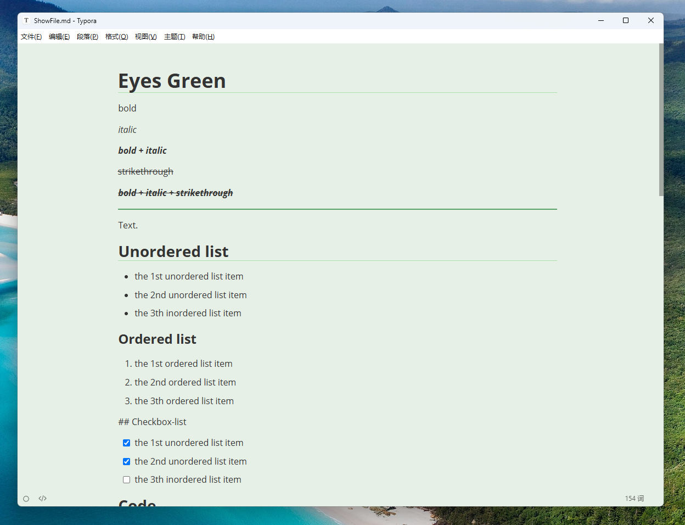
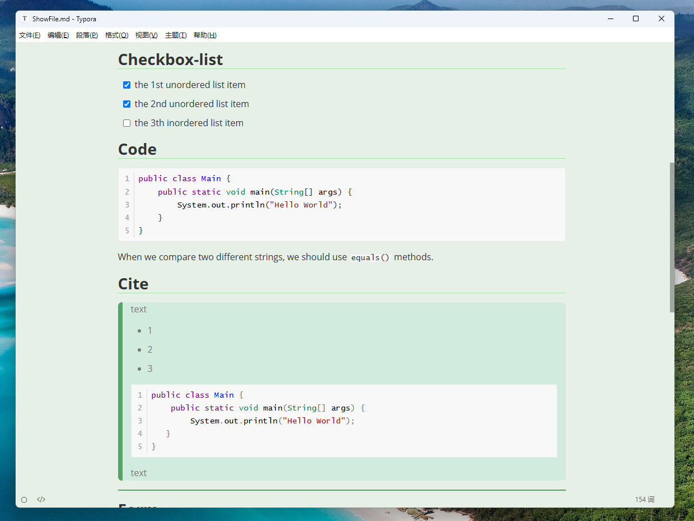
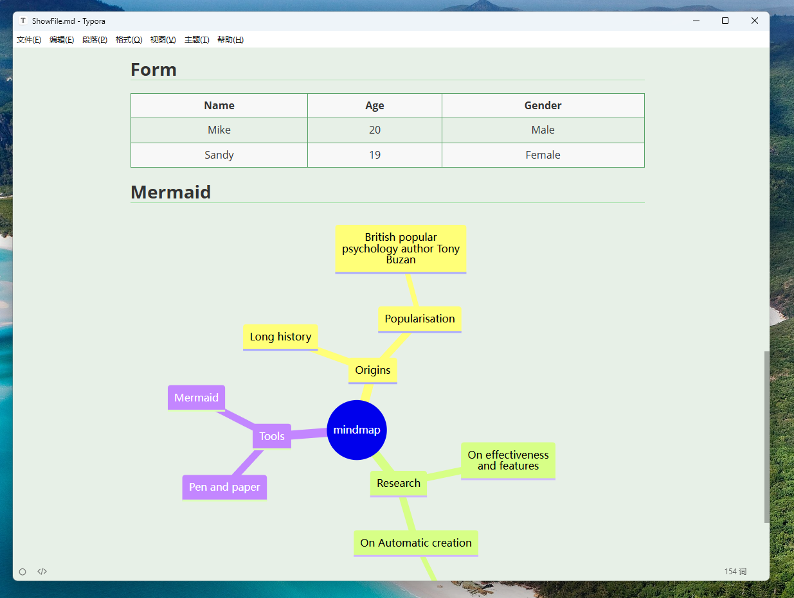
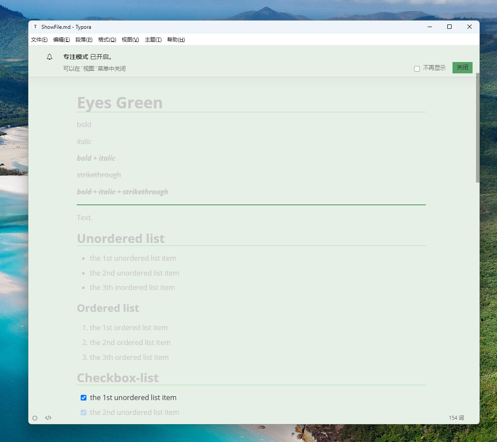

# Eyes Green
[简体中文](./README-cn.md)

This theme is based on Typora's default [GitHub](https://theme.typora.io/theme/Github/) theme. It adjusts background colors and modifies certain Markdown display effects to provide a comfortable, eye-friendly experience when viewing or editing Markdown files.

This theme is exceptionally clean and simple, delivering an excellent eye-friendly experience while maintaining the performance and efficiency of the default theme without altering user habits.

## ScreenShots

## Notes
Designed and tested on Windows 11. Not fully tested yet, but should run on macOS/Linux.

## Installation
1. Click the “Download” button of this page, download file and extract it.
2. In Typora, open “Preferences” ( File > Preferences ). And then switch to the “Appearance” tab and click the “Open Theme Folder” button.
3. Copy the `eyes-green.css`  into Typora’s theme folder.
4. Restart Typora and select the Eyes Green  theme from the theme menu.

## Infomation
- Authour：AqiMake
- HomePage：[AqiMake/typora-eyes-green-theme](https://github.com/AqiMake/typora-eyes-green-theme)

