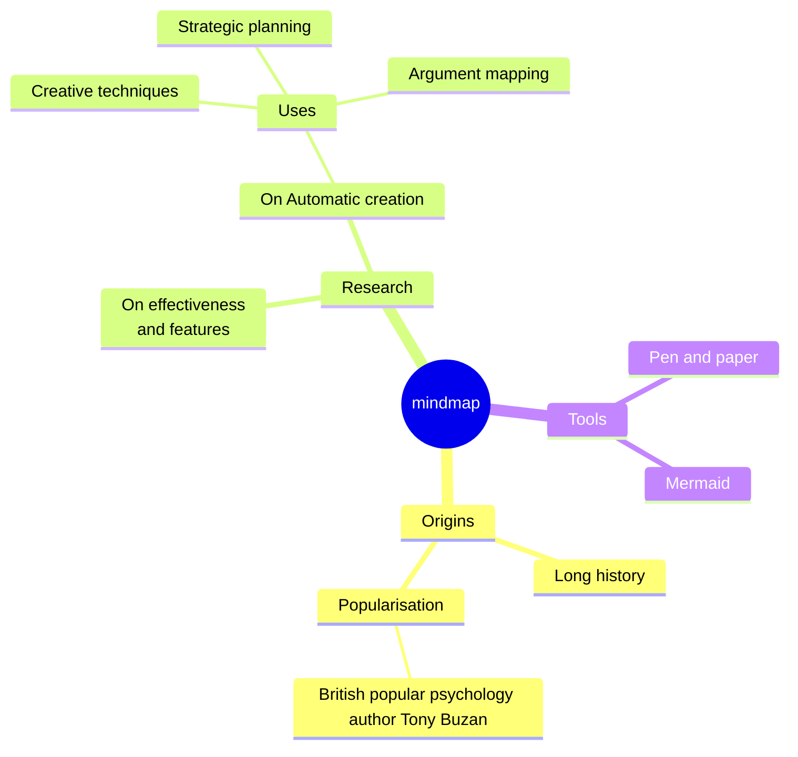

# Eyes Green

**bold**

*italic*

***bold + italic***

~~strikethrough~~

***~~bold + italic + strikethrough~~***

***
Text.

## Unordered list

- the 1st unordered list item
- the 2nd unordered list item
- the 3th inordered list item

### Ordered list
1. the 1st ordered list item
2. the 2nd ordered list item
3. the 3th ordered list item

## Checkbox-list

- [x] the 1st unordered list item
- [x] the 2nd unordered list item
- [ ] the 3th inordered list item

## Code
```java
public class Main {
    public static void main(String[] args) {
        System.out.println("Hello World");
    }
}
```

When we compare two different strings, we should use `equals()` methods.

## Cite
> text
> - 1
> - 2
> - 3
> ```java
> public class Main {
>     public static void main(String[] args) {
>         System.out.println("Hello World");
>    }
> }
> ```
> text
***
## Form

| Name| Age| Gender|
|:-:|:-:|:-:|
| Mike| 20| Male|
| Sandy| 19| Female|

## Mermaid



